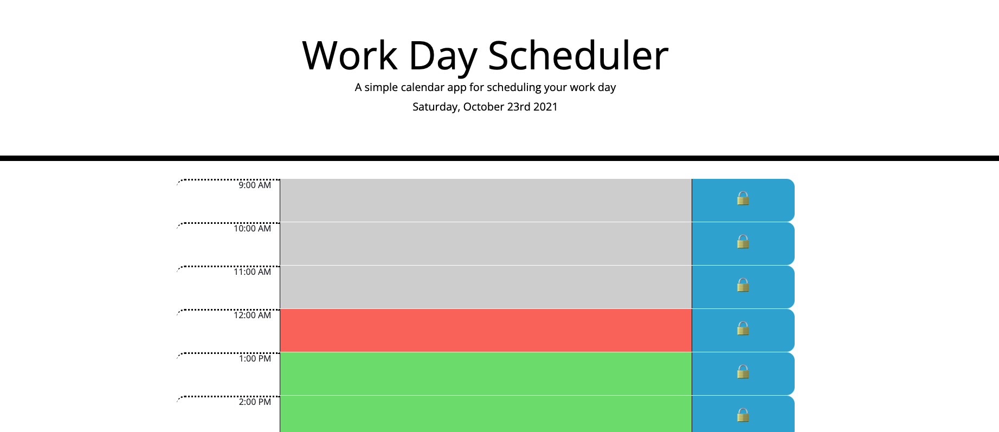
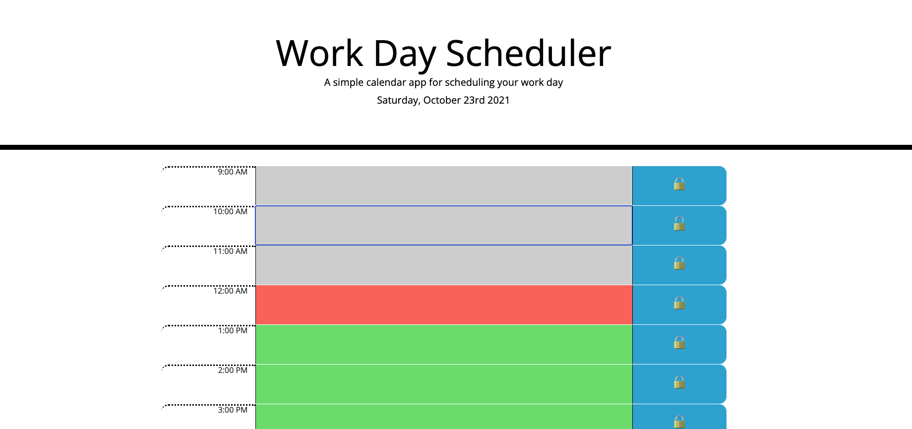
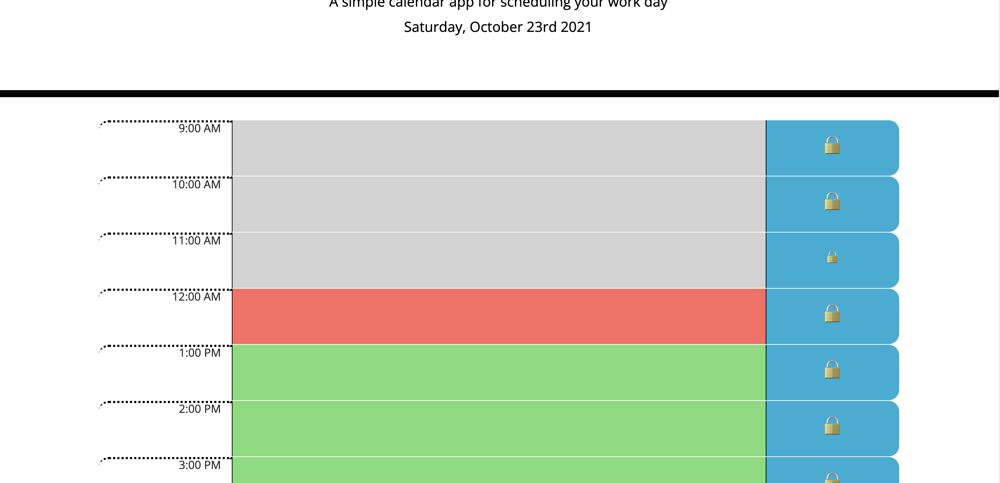
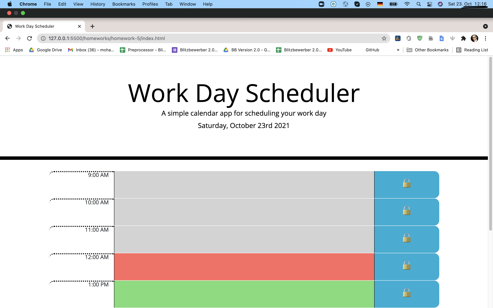

# Fantastic-Daily-Calendar

A fantastic calendar that keeps appointments and important events through out the work day between 9 am and 5 pm.

### Built With

* HTML5
* CSS3
* JavaScript ES6
* jQuery
* Bootstrap

## Features

* Day's date is displayed at the top of the calendar
* Appointments are added by clicking on the hour slots, with the lock on the save button unlocking
* Saving the through clicking on the button locks the lock and saves calendar entries to the local storage
* The time slot that matches the present hour is in red, the past ones are in grey and future ones are in green, and this moves dynamically
* Local storage is reset every day

## Getting Started

This is an example of how you may give instructions on setting up your project locally.
To get a local copy up and running follow these simple example steps.

### Prerequisites

A web browser.

### Installation

Not Required.

## Screenshots of product journey

#### Clicking on slots unlocks the save button and activates a text box where the appointment details is provided

#### Clicking on the button locks it and saves to local storage

#### Current hour time slot is in red, past is grey and future is green

